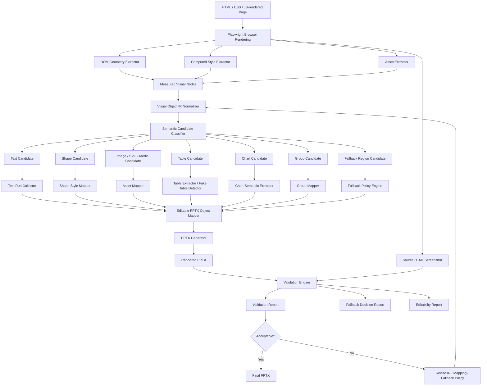
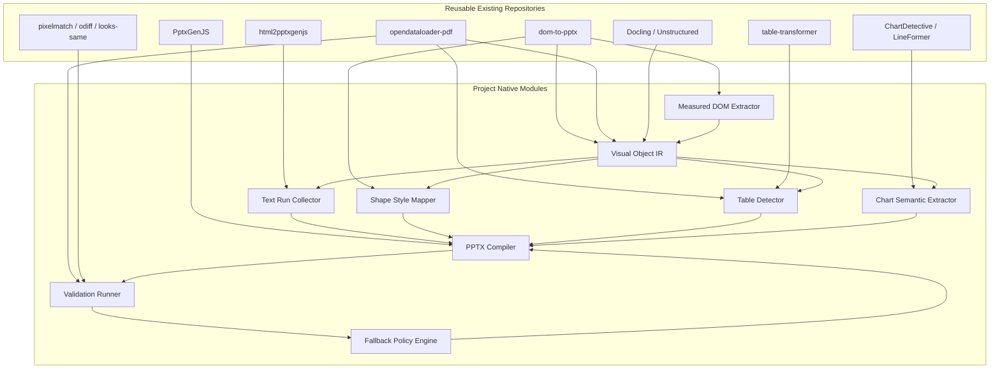
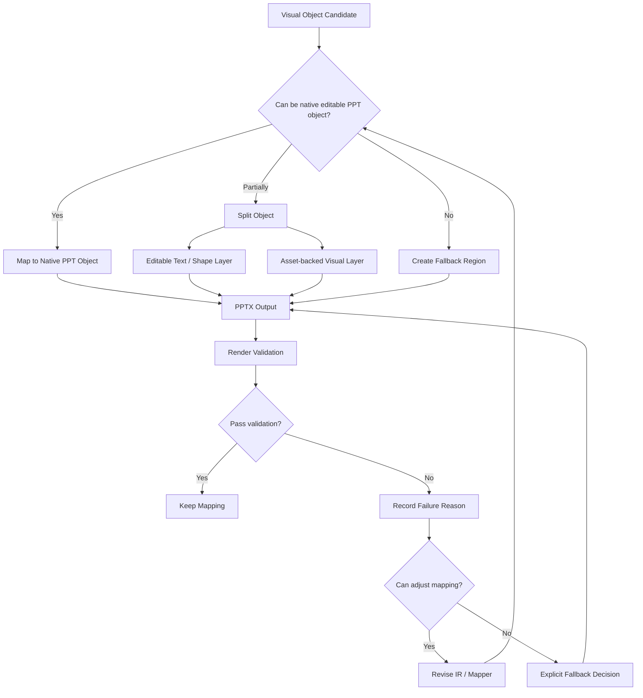
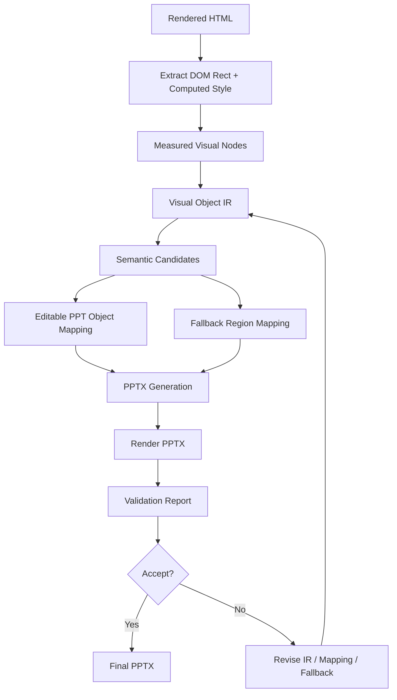

# Architecture v0.1

This document describes the first architecture blueprint for `html-to-editable-pptx`.

The core goal is to convert rendered HTML into editable PowerPoint objects, not to export screenshots by default.

## 1. Architecture summary

```text
Rendered HTML
  -> browser measurement
  -> measured visual nodes
  -> Visual Object IR
  -> semantic candidates
  -> editable PPT object mapping
  -> PPTX generation
  -> rendered validation
```

## 2. Full pipeline



## 3. Layered module design

```mermaid
flowchart LR
    subgraph InputLayer[Input Layer]
        A1[HTML]
        A2[CSS]
        A3[JS Runtime]
        A4[External Assets]
    end

    subgraph RenderLayer[Browser Render Layer]
        B1[Playwright]
        B2[getBoundingClientRect]
        B3[getComputedStyle]
        B4[DOM Traversal]
    end

    subgraph ExtractionLayer[Extraction Layer]
        C1[Measured Visual Node Extractor]
        C2[Text Node Extractor]
        C3[Image / SVG Extractor]
        C4[Table DOM Extractor]
        C5[Chart Region Detector]
    end

    subgraph IRLayer[Visual Object IR Layer]
        D1[Visual Object IR Schema]
        D2[Wrapper Normalizer]
        D3[Semantic Candidate Classifier]
        D4[Reading Order Resolver]
        D5[Z-order Resolver]
    end

    subgraph MappingLayer[PPT Mapping Layer]
        E1[Text Run Collector]
        E2[Shape Mapper]
        E3[Image / SVG Asset Mapper]
        E4[Native Table Mapper]
        E5[Native Chart Mapper]
        E6[Fallback Region Mapper]
    end

    subgraph OutputLayer[Output Layer]
        F1[PptxGenJS Backend]
        F2[PPTX File]
        F3[Debug JSON]
        F4[Debug HTML Overlay]
    end

    subgraph ValidationLayer[Validation Layer]
        G1[Render PPTX]
        G2[Pixel Diff]
        G3[Overflow Check]
        G4[Font Substitution Check]
        G5[Editability Score]
        G6[Validation Report]
    end

    InputLayer --> RenderLayer
    RenderLayer --> ExtractionLayer
    ExtractionLayer --> IRLayer
    IRLayer --> MappingLayer
    MappingLayer --> OutputLayer
    OutputLayer --> ValidationLayer
    ValidationLayer --> IRLayer
```



## 4. Reuse blueprint



## 5. Native object versus fallback decision flow



## 6. Minimal v0.1 path

For the first implementation, the shortest useful path is:



## 7. v0.1 implementation order

1. Define `src/ir/schema.ts`.
2. Create measured DOM extraction prototype.
3. Convert simple text, shape, image, and semantic table objects.
4. Generate PPTX through PptxGenJS.
5. Render PPTX and compare against the source screenshot.
6. Write validation and fallback reports.
7. Add fake table and chart recovery only after the base path is validated.

## 8. Explicit non-goals for v0.1

- Do not build a custom CSS layout engine.
- Do not guarantee pixel-perfect visual equality.
- Do not solve arbitrary canvas chart reconstruction.
- Do not solve arbitrary SVG chart semantic recovery.
- Do not create a full visual regression platform.
- Do not optimize for batch throughput before the single-page path is stable.
