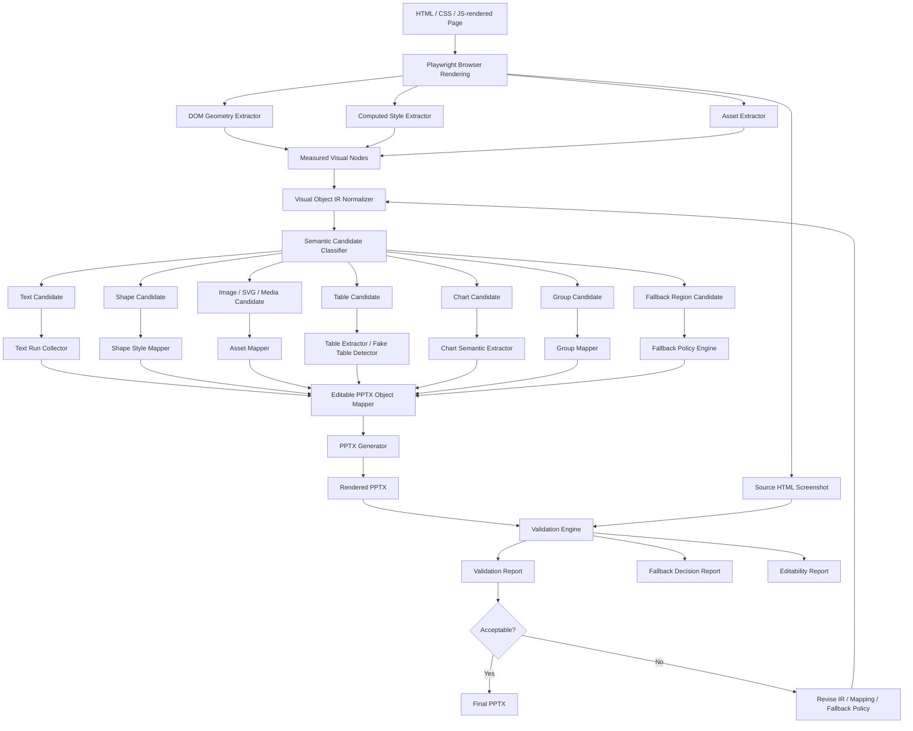
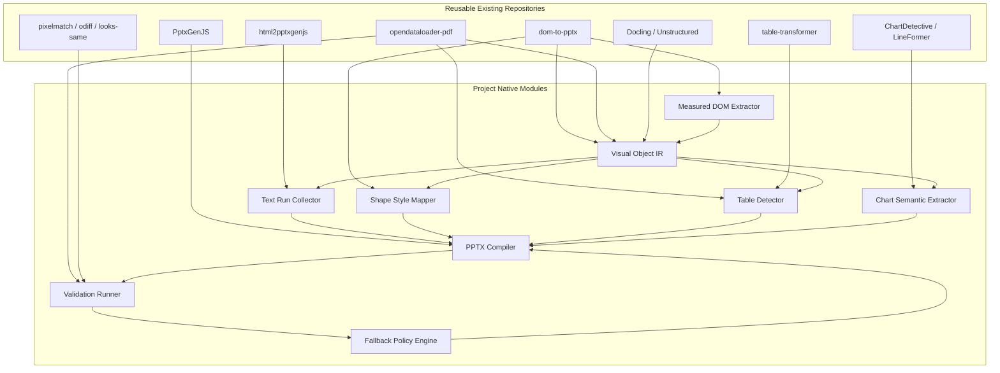
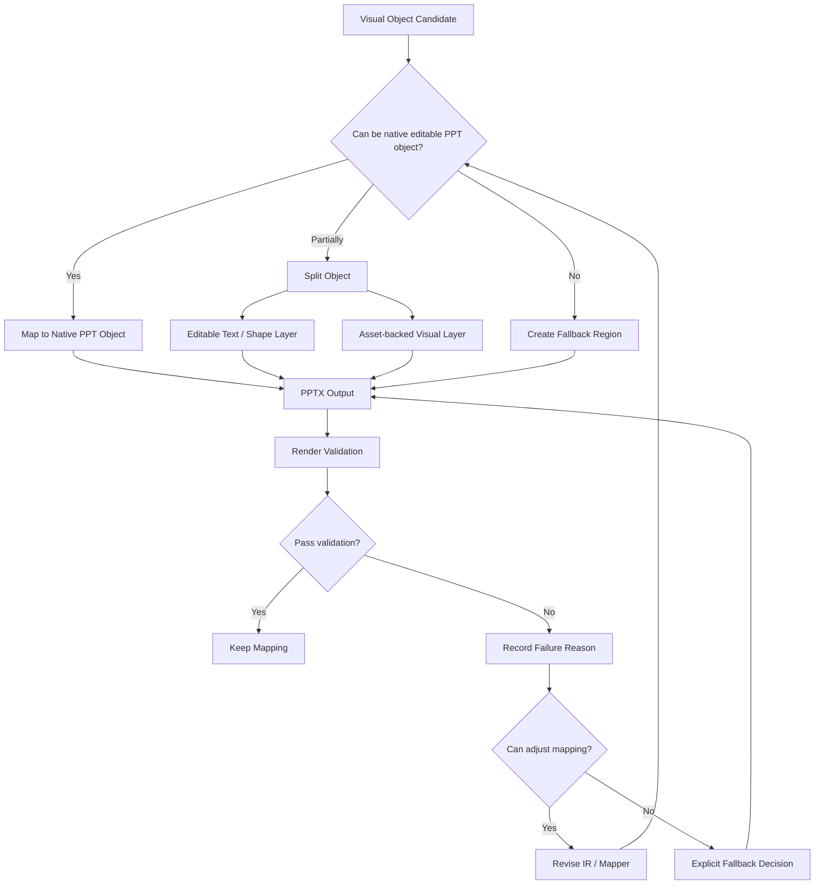
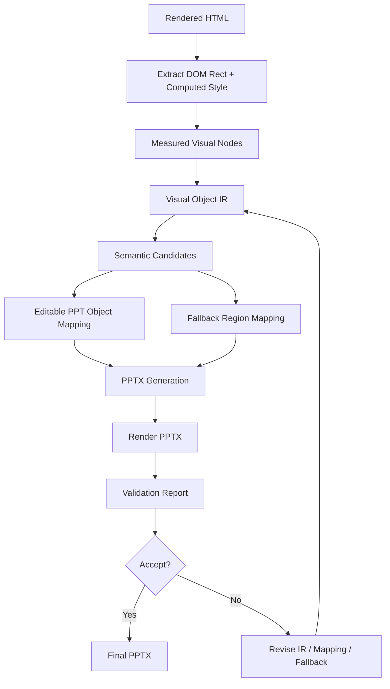

# Architecture v0.1

This document describes the first architecture blueprint for `html-to-editable-pptx`.

The core goal is to convert rendered HTML into editable PowerPoint objects, not to export screenshots by default.

## 1. Architecture summary

```text
Rendered HTML
  -> browser measurement
  -> measured visual nodes
  -> Visual Object IR
  -> semantic candidates
  -> editable PPT object mapping
  -> PPTX generation
  -> rendered validation
```

## 2. Full pipeline


```mermaid
flowchart TD
    A[HTML / CSS / JS-rendered Page] --> B[Playwright Browser Rendering]

    B --> C[DOM Geometry Extractor]
    B --> D[Computed Style Extractor]
    B --> E[Asset Extractor]

    C --> F[Measured Visual Nodes]
    D --> F
    E --> F

    F --> G[Visual Object IR Normalizer]

    G --> H[Semantic Candidate Classifier]

    H --> H1[Text Candidate]
    H --> H2[Shape Candidate]
    H --> H3[Image / SVG / Media Candidate]
    H --> H4[Table Candidate]
    H --> H5[Chart Candidate]
    H --> H6[Group Candidate]
    H --> H7[Fallback Region Candidate]

    H1 --> I1[Text Run Collector]
    H2 --> I2[Shape Style Mapper]
    H3 --> I3[Asset Mapper]
    H4 --> I4[Table Extractor / Fake Table Detector]
    H5 --> I5[Chart Semantic Extractor]
    H6 --> I6[Group Mapper]
    H7 --> I7[Fallback Policy Engine]

    I1 --> J[Editable PPTX Object Mapper]
    I2 --> J
    I3 --> J
    I4 --> J
    I5 --> J
    I6 --> J
    I7 --> J

    J --> K[PPTX Generator]

    K --> L[Rendered PPTX]
    B --> M[Source HTML Screenshot]

    L --> N[Validation Engine]
    M --> N

    N --> O[Validation Report]
    N --> P[Fallback Decision Report]
    N --> Q[Editability Report]

    O --> R{Acceptable?}
    R -->|Yes| S[Final PPTX]
    R -->|No| T[Revise IR / Mapping / Fallback Policy]
    T --> G
```

## 3. Layered module design


```mermaid
flowchart LR
    subgraph InputLayer[Input Layer]
        A1[HTML]
        A2[CSS]
        A3[JS Runtime]
        A4[External Assets]
    end

    subgraph RenderLayer[Browser Render Layer]
        B1[Playwright]
        B2[getBoundingClientRect]
        B3[getComputedStyle]
        B4[DOM Traversal]
    end

    subgraph ExtractionLayer[Extraction Layer]
        C1[Measured Visual Node Extractor]
        C2[Text Node Extractor]
        C3[Image / SVG Extractor]
        C4[Table DOM Extractor]
        C5[Chart Region Detector]
    end

    subgraph IRLayer[Visual Object IR Layer]
        D1[Visual Object IR Schema]
        D2[Wrapper Normalizer]
        D3[Semantic Candidate Classifier]
        D4[Reading Order Resolver]
        D5[Z-order Resolver]
    end

    subgraph MappingLayer[PPT Mapping Layer]
        E1[Text Run Collector]
        E2[Shape Mapper]
        E3[Image / SVG Asset Mapper]
        E4[Native Table Mapper]
        E5[Native Chart Mapper]
        E6[Fallback Region Mapper]
    end

    subgraph OutputLayer[Output Layer]
        F1[PptxGenJS Backend]
        F2[PPTX File]
        F3[Debug JSON]
        F4[Debug HTML Overlay]
    end

    subgraph ValidationLayer[Validation Layer]
        G1[Render PPTX]
        G2[Pixel Diff]
        G3[Overflow Check]
        G4[Font Substitution Check]
        G5[Editability Score]
        G6[Validation Report]
    end

    InputLayer --> RenderLayer
    RenderLayer --> ExtractionLayer
    ExtractionLayer --> IRLayer
    IRLayer --> MappingLayer
    MappingLayer --> OutputLayer
    OutputLayer --> ValidationLayer
    ValidationLayer --> IRLayer
```

> **Scope note** (per ULTIMATE_GOAL_v0.1.md §5 non-commitment to
> PPTX richness): "Media Candidate" means a reference to an asset
> (image, SVG, video thumbnail) or a placeholder, not an editable
> timeline, animation, or media authoring object. Video is
> represented as a thumbnail or asset reference; GIFs do not support
> frame-level editing. This boundary mirrors GOAL_PROBLEM_v0.1.md
> §"Target conversion policy" non-goals.

## 4. Reuse blueprint

> **Vocabulary crosswalk** (slot ↔ named slot ↔ category ↔ module ↔ semanticType)
> is owned by `docs/vocabulary_v0.1.md` (D-2-2 final, 2026-06-12). Decision record:
> `docs/integration_step2_consensus_v0.1.md`.


```mermaid
flowchart TD
    subgraph ExistingRepos[Reusable Existing Repositories]
        R1[dom-to-pptx]
        R2[html2pptxgenjs]
        R3[PptxGenJS]
        R4[opendataloader-pdf]
        R5[Docling / Unstructured]
        R6[table-transformer]
        R7[ChartDetective / LineFormer]
        R8[pixelmatch / odiff / looks-same]
    end

    subgraph ProjectModules[Project Native Modules]
        M1[Measured DOM Extractor]
        M2[Visual Object IR]
        M3[Text Run Collector]
        M4[Shape Style Mapper]
        M5[Table Detector]
        M6[Chart Semantic Extractor]
        M7[Fallback Policy Engine]
        M8[PPTX Compiler]
        M9[Validation Runner]
    end

    R1 --> M1
    R1 --> M2
    R1 --> M4

    R2 --> M3

    R3 --> M8

    R4 --> M2
    R4 --> M5
    R4 --> M9

    R5 --> M2

    R6 --> M5

    R7 --> M6

    R8 --> M9

    M1 --> M2
    M2 --> M3
    M2 --> M4
    M2 --> M5
    M2 --> M6
    M3 --> M8
    M4 --> M8
    M5 --> M8
    M6 --> M8
    M7 --> M8
    M8 --> M9
    M9 --> M7
```

## 5. Native object versus fallback decision flow


```mermaid
flowchart TD
    A[Visual Object Candidate] --> B{Can be native editable PPT object?}

    B -->|Yes| C[Map to Native PPT Object]
    B -->|Partially| D[Split Object]

    D --> D1[Editable Text / Shape Layer]
    D --> D2[Asset-backed Visual Layer]

    B -->|No| E[Create Fallback Region]

    C --> F[PPTX Output]
    D1 --> F
    D2 --> F
    E --> F

    F --> G[Render Validation]
    G --> H{Pass validation?}

    H -->|Yes| I[Keep Mapping]
    H -->|No| J[Record Failure Reason]

    J --> K{Can adjust mapping?}
    K -->|Yes| L[Revise IR / Mapper]
    K -->|No| M[Explicit Fallback Decision]

    L --> B
    M --> F
```

## 6. Minimal v0.1 path

For the first implementation, the shortest useful path is:


```mermaid
flowchart TD
    A[Rendered HTML] --> B[Extract DOM Rect + Computed Style]
    B --> C[Measured Visual Nodes]
    C --> D[Visual Object IR]
    D --> E[Semantic Candidates]
    E --> F[Editable PPT Object Mapping]
    E --> G[Fallback Region Mapping]
    F --> H[PPTX Generation]
    G --> H
    H --> I[Render PPTX]
    I --> J[Validation Report]
    J --> K{Accept?}
    K -->|Yes| L[Final PPTX]
    K -->|No| M[Revise IR / Mapping / Fallback]
    M --> D
```

## 7. v0.1 implementation order

1. Define `src/ir/schema.ts`.
2. Create measured DOM extraction prototype.
3. Convert simple text, shape, image, and semantic table objects.
4. Generate PPTX through PptxGenJS.
5. Render PPTX and compare against the source screenshot.
6. Write validation and fallback reports.
7. Add fake table and chart recovery only after the base path is validated.

## 8. Explicit non-goals for v0.1

- Do not build a custom CSS layout engine.
- Do not guarantee pixel-perfect visual equality.
- Do not solve arbitrary canvas chart reconstruction.
- Do not solve arbitrary SVG chart semantic recovery.
- Do not create a full visual regression platform.
- Do not optimize for batch throughput before the single-page path is stable.

---

## 9. Language and runtime topology (added 2026-06-12, D-2-3)

**Decided:** Python + Node.js mixed runtime — both are canonical, not temporary.

Prior non-canonical record (reuse_report_v0.1 §8 table_transformer non-goals, "Do not
run Python in the bootstrap pipeline. Node-only.") is superseded by this section.
That statement was scope-limited to table_transformer integration and was never
ratified as a project-wide architecture decision. The bootstrap implementation
(sessions 2–3, see docs/integration_step2_consensus_v0.1.md D-2-3) validated Python
as the extraction backend; this section makes that topology official.

### Runtime boundary rules

```text
Python runtime
  src/extract/weasy_extract.py     HTML → IR JSON   (WeasyPrint CSS layout engine)
  src/validate/validate_ab.py      Layer A + B       (bag-of-lines, MD5)
  src/validate/layout_d.py         Layer D           (IR bbox vs OOXML IoU)

Node.js runtime
  src/map/ir_to_pptx.mjs           IR JSON → .pptx  (PptxGenJS, jszip, @xmldom/xmldom)
  src/validate/pixel_c.mjs         Layer C           (pixelmatch PNG diff)
  src/output/normalize-zip.js      OOXML repair      (transplanted from dom-to-pptx)
```

### Boundary constraints

1. **File-system only IPC.** Python and Node communicate exclusively through files
   (IR JSON, .pptx, .png, report JSON). No subprocess calls between the two runtimes.
2. **Single orchestrator.** `scripts/run.sh` is the only entry point. It sequences
   and parallelises the two runtimes.
3. **Python owns layout, Node owns serialisation.** The extraction-to-IR step uses
   Python because WeasyPrint is a deterministic, rule-based CSS layout engine with a
   full box-tree API. The PPTX output step uses Node because PptxGenJS is Node-native
   and the npm ecosystem covers OOXML tooling (jszip, @xmldom/xmldom).
4. **No cross-runtime function calls.** If a future stage needs logic from both
   sides, it goes through a new IR field, not an inter-process call.

### Rationale for WeasyPrint vs Playwright (AE-05 partial answer)

WeasyPrint is the v0.1 extraction backend because the current supported input class
is static HTML/CSS slides. It is deterministic for the same input, avoids browser
binary/runtime dependency, and exposes a direct box-tree API. The IR schema isolates
the extraction backend choice: if JS-rendered DOM becomes v1 scope, a future
Playwright migration should replace `src/extract/weasy_extract.py` without changing
the IR contract or downstream mapper/validation modules.
